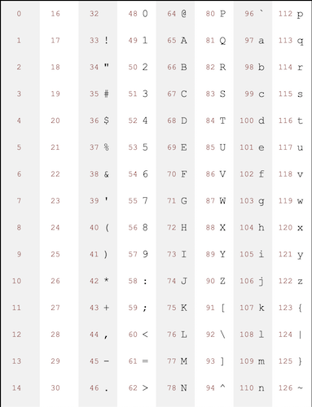
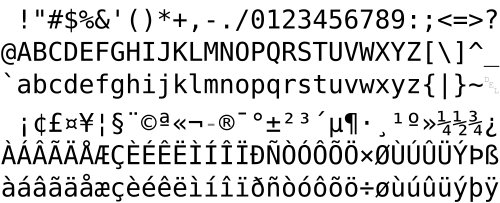
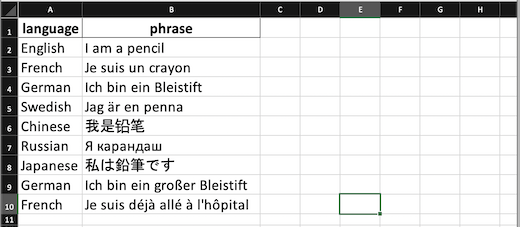
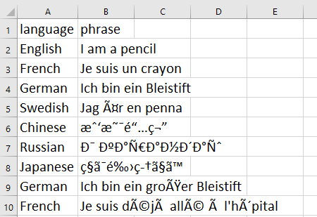
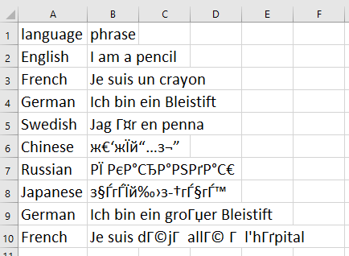
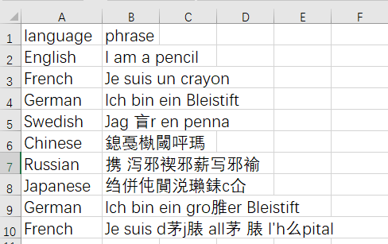

# Encoding issues with Excel

## What is character encoding?

Inside of your computer, each letter you see on the screen is represented by a *number*. For example, `HELLO` is actually `72 69 76 76 79`.

|We see|H|E|L|L|O|
|---|---|---|---|---|---|
|The computer sees|`72`|`69`|`76`|`76`|`79`|

It's even different between uppercase and lowercase!

|We see|h|e|l|l|o|
|---|---|---|---|---|---|
|The computer sees|`104`|`101`|`108`|`108`|`111`|

This is called **character encoding**. Each character (text symbol) you see is encoded (translated) into a specific number for the computer to understand it.

## The history

When computer scientists were first [coming up with these lists of text symbols and the numbers that represented them](https://en.wikipedia.org/wiki/ASCII#Overview), they were primarily thinking about America, not the rest of the world. As a result, early versions of character encoding only supported 128 total characters, which was mostly the "normal" English alphabet of A through Z.

This encoding was called ASCII, and it didn't support accents at all. If you were using a computer, you couldn't order a frappé, eat a jalapeño, or see your doppelgänger!

Eventually a new encoding was developed that doubled the characters to 256, which brought support for most of the Western European languages. It was called ISO 8859-1 (or Latin-1).

With ISO 8859-1, you could finally eat at a café! But you still couldn't read anything by [Karel Čapek](https://en.wikipedia.org/wiki/Karel_%C4%8Capek), much less [Лев Толстой](https://en.wikipedia.org/wiki/Leo_Tolstoy) or plan a visit to [Παρθενώνας](https://en.wikipedia.org/wiki/Parthenon).

Everyone was grumpy about this, and tired of waiting for these (mostly) American computer scientists to build a system that supported their languages. Each country was missing different characters, so they *all invented their own encodings.* There was a [Thai one](https://en.wikipedia.org/wiki/ISO/IEC_8859-11) and a [Turkish one](https://en.wikipedia.org/wiki/ISO/IEC_8859-9) and a [Japaense one](https://en.wikipedia.org/wiki/Shift_JIS) and many, many more.

This went on for *decades!* Every once in a while people would try to invent a system that supported every language, but nothing ever really took off.

### Hello Unicode and UTF-8 👋

Until one very special, very magic thing happend: ✨✨✨emoji!✨✨✨

Just like the letter `H` is the number `72`, every emoji gets a number, too. For example, the number for the taco emoji 🌮 is `127,790`. To get this right, computers everywhere had to agree on which emoji were which numbers. Otherwise I might email you a 😂😂😂 and have it show up on your screen as a 💀💀💀! 

> You can read [a long history of emoji on WIRED](https://www.wired.com/story/guide-emoji/) if you'd like to learn more.

Instead of only having computers support a list of only 128 or 256 different characters, it was decided to make a much, much, *much* longer list. This time they wanted to support *all* languages and *all* emoji, and never run out of room, so this new standard can support *over a million characters*.

This new standard is called **Unicode** or **UTF-8**. Technically they're different things, but the difference isn't terribly important to us.

With Unicode, you can finally watch アニメ, eat 김치, or visit 上海.

## Why encoding matters

When you open a file on your computer, the software needs to be told what encoding it's in. That way it can know what numbers translate into what text symbols.

There are **two data files** that you can look at in this repository:

* [encoded-excel.xlsx](encoded-excel.xlsx)
* [encoded-commas.csv](encoded-commas.csv)

The first is an `xlsx` file, a "true" Excel file. Along with the data, Excel stores the encoding for the data inside. When you open it, it should look perfect and fine:

I hope that was fun because now it's time for trouble.

### The trouble with CSV files

If you open the `csv` file it doesn't work so well, and all sorts of weird characters might show up on your screen. But the interesting thing is *what gets displayed depends on where your computer is from.* Below are some screenshots of what it might look like in different countries:

|American|French|Russian|Chinese|
|---|---|
|||||

**Why does this happen?** When Excel opens a CSV file, there's nothing in the CSV file that tells it what encoding to use. The csv file is just a series of numbers to translate into text. 

To open the file, Excel has to *guess* what character encoding to use. Because Microsoft is awful, it always guesses the olden-days country-specific character encodings instead of the cool new Unicode/UTF-8 emoji-friendly encodings. If you're in the US it guesses the US character encoding, if you're in Germany it guesses the German one, etc etc etc. That's why they all look different.

> You can specify UTF-8 when opening CSV files in Excel if you [jump through some hoops](https://answers.microsoft.com/en-us/msoffice/forum/all/how-to-open-utf-8-csv-file-in-excel-without-mis/1eb15700-d235-441e-8b99-db10fafff3c2), but let me just say [Google sheets](https://sheets.google.com/) *always* opens CSV files as UTF-8.

### When should I worry?

Unfortunately, the only way to know if the data has been opened correctly is by reading through it and making sure everything looks right. Make sure your Muñoz isn't Mu�oz!

Older versions of Excel tend to save CSV files with local/country-specific encodings, and you'll often find these versions at government agencies. Pay special attention when you're getting smaller CSV datasets from state and local governments, especially if you're working across borders.

> US government agencies are likely to export CSV files that have mangled accents like é and ñ, since they're infrequently enough that they escape notice.

## Exporting CSV files from Excel

Character encoding also causes issues when exporting CSV files from Excel. When saving a CSV, you have two options, a "normal" CSV file that saves it as your local/country-specific encoding, or a special UTF-8 one that supports the rest of the world.

|description|image|
|---|---|
|A non-UTF-8-friendly CSV||
|A UTF-8-friendly CSV||

You obviously always want the UTF-8 one!
