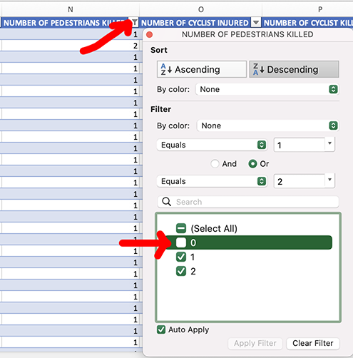
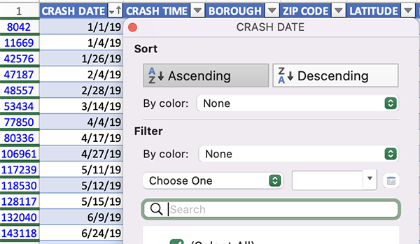
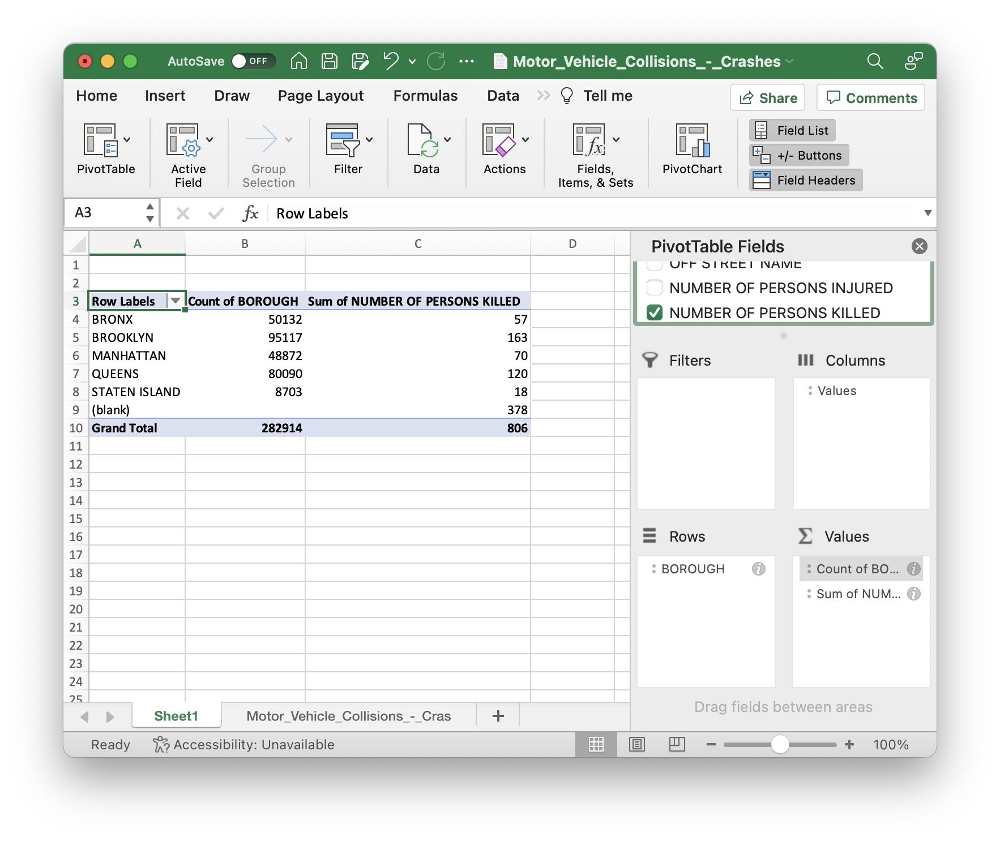

# Answers

## 📝 Question Set One: Documentation

### 1. What NYC department provides the motor vehicle collision data? 

NYPD

### 2. What are the conditions that are required to be met for a motor vehicle collision to be included in this dataset?

From the data dictionary Excel file, "The police report (MV104-AN) is required to be filled out for collisions where someone is injured or killed, or where there is at least $1000 worth of damage"

### 3. What are some of the limitations of this data, according to the city’s description? 

Not all crashes meet the requirements to be entered. Also in the data dictionary Excel file, "it should be noted that the data is preliminary and subject to change when the MV-104AN forms are amended based on revised crash details."

### 4. What might be an issue with comparing 2013 traffic data to 2017 motor vehicle collision data?

In 2016 the Traffic Accident Management System (TAMS) was replaced with Finest Online Management System (FORMS).

### 5. What are the two types of locations a pedestrian can be marked as present at? (You can copy and paste this from the documentation if you find it there)

In the "Column info" tab of the data dictionary Excel, the answer appears to be 

1. At intersection
2. Not at intersection

### 6. According to the documentation, what are the eight types of vehicles that could be included in the columns that refer to "vehicle type?" (You can copy and paste this from the documentation if you find it there)

In the "Column info" tab of the data dictionary Excel, the answer appears to be 

1. ATV
2. Bicycle
3. Car/suv
4. Ebike
5. Escooter
6. Truck/bus
7. Motorcycle
8. Other

## 📝 Question Set Two: Examining, filtering and sorting

Before we get started, convert the spreadsheet into a table by pressing Command+T (OS X) or Ctrl+T (Windows).

### 1. How many rows are there in the data?

Scroll to the bottom of the table.

If you click on a column header it will give you a row count, but it will only be the *filled-in rows*. There's a lot of missing data!

### 2. Do you notice any potential limitations of the data just by glancing through it? What are they?

There are all sorts of problems! Missing data is probably the most obvious one.

### 3. What is the most number of people injured in one crash? Where and when did this incident happen?

Click the dropdown next to `NUMBER OF PERSONS INJURED` and select **Descending**.

Twenty people were injured in a crash on 11/27/19 on the Staten Island Expressway.

### 4. Does "number of persons killed" include pedestrians and cyclists, or just motorists? 

Yes, it includes pedestrians and cyclists.

There are plenty of ways to do this – I filtered for non-zero pedestrian fatalities, and compared the pedestrian fatalities and motorist fatalities to the total fatalities.

### 5. How far into 2019 was it before a cyclist was killed?

About six hours. Filter for non-zero cyclist fatalities, then sort by date.

## 📝 Question Set Three: Pivot tables

We'll start by clicking the "Summarize with PivotTable" button in the Table tab.

Then we'll be presented with a blank pivot table!

### 1. What borough has the most crashes?

For a simple count, you only need to place `BOROUGH` under rows. The value section will automatically be **Count of BOROUGH**.

You can also put it under columns instead, but for some reason that's very untraditional!

### 2. For each borough, list the number of people killed in motor vehicle crashes during this timeframe.

To total up the number of people killed, you'll add `NUMBER OF PERSONS KILLED` to the values section. It will automatically set it as the sum, which is what we're looking for.

### 3. What percent of vehicle-related deaths are pedestrians? You can use a pivot table or calculate this yourself from the raw numbers

If you uncheck `BOROUGH` from the rows section and add `NUMBER OF PEDESTRIANS KILLED` to the values section, you'll be able to calculate 362/806 = about 45%.

If you enjoy formulas more: you can use a formula with one `SUM(...)` for the pedestrian deaths and another `SUM(...)` for the motorists deaths, then divide the two (the formula looks crazy but I just typed `SUM(`, clicked the pedestrian deaths column, and Excel filled in the rest).

### 4. Do the vehicle types in the actual dataset match the documentation? If not, list a few that are missing from the documentation.

You can find what appear to be lists of the vehicle types in both the data dictionary Excel file, as well as the crash form PDF.

To find a list of the vehicle type codes the dataset *actually* uses by clicking the dropdown next to `VEHICLE TYPE CODE 1`.

Regardless of whether `4 dr sedan` should be `sedan` or `car`, we can probably all agree that `994`, `2015`, and `''lime mope` are all not listed in the documentation.
