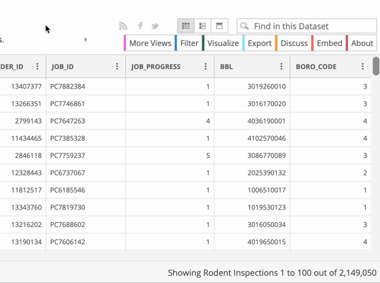
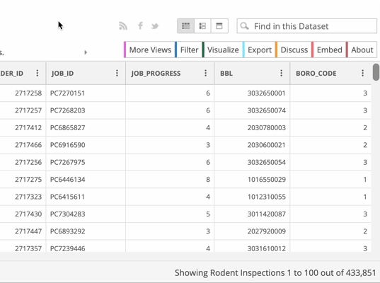
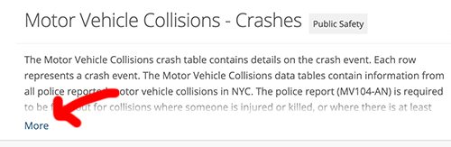

# Downloading NYC's motor vehicle collisions data

The data that we’ll be using for this exercise is New York City’s **motor vehicle collisions data.** The full file is [larger than Excel can support](../row-limits/), so we'll only be looking at 2019-2021.

## Navigating to the data

1. Visit the [Motor Vehicle Collisions - Crashes page](https://data.cityofnewyork.us/Public-Safety/Motor-Vehicle-Collisions-Crashes/h9gi-nx95) of the NYC OpenData portal
2. Click the **View Data** button, and take a second to examine the data. Does this look like the data we're looking for?

## Filtering the data

1. We don't want all 2+ million rows, so click the **Filter** button
2. Click **Add a new filter condition**
3. The dropdown should already be set to `CRASH_DATE`. If not, set it to `CRASH_DATE`.
4. Use the other dropdown to change `is` to `is between`.
5. Use the date selection boxes to select **January 1, 2019** to **December 31, 2021**.
6. Before moving on to the next step, confirm that there are around 400-500 thousand rows by finding the "Showing Motor Vehicle Collisions 1 to 100 out of..." line at the bottom of the spreadsheet.

## Exporting the data

1. Click **Export**. It should automatically open the "Download" section.
2. Click **CSV** to download in CSV format. *Even though we are using Excel we will **not** be using CSV for Excel*

> If you're interested in understanding what **CSV for Excel** means, [read about encoding](../encoding)

# Downloading the data documentation

Beyond the data, there is typically additional documentation that can be used to help understand what the data is, how it was sourced, and what each column *really* means. **You always want to download any available documentation when sourcing data.**

Return to the [Motor Vehicle Collisions - Crashes page](https://data.cityofnewyork.us/Public-Safety/Motor-Vehicle-Collisions-Crashes/h9gi-nx95) to find and download the **data dictionary**. The data dictionary is an Excel file listed under **Attachments**.

> Tip: It is located under **Attachments**. If you can't find it on the page, I've also saved it [here](https://github.com/jsoma/excel-tutorials/raw/main/pivot-tables/MVCollisionsDataDictionary_20190813_ERD.xlsx).

Additionally, there is a large amount of information describing the dataset at the beginning of the page, slightly hidden. It's a long long description right under the title, but you need to click the **More** button. It might be useful to save this information into a document to refer to later.

Inside of the **More** section, you can also find a link to the police report that these rows are based on. Download that as well.