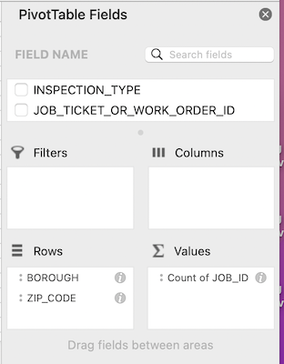
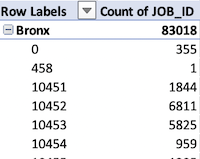

You must [download NYC's 2019-2021 rodent inspections](downloading.md) to complete this assignment.

> This is a combination problem set and tutorial. The more advanced version would be [our motor vehicle collisions dataset](../pivot-tables-crashes/).

# Rodent inspection dataset analysis

Before you start to analyze a dataset, you need to understand its content and limitations. To prepare for answering the questions below, you will want to skim through the documentation available to you. This includes:

1. The top portion of the [the Rodent Inspection dataset page](https://data.cityofnewyork.us/Health/Rodent-Inspection/p937-wjvj)
2. The user guide and data dictionary files you [already downloaded](downloading.md#downloading-the-data-documentation)
3. [This NYC city page on rats](https://www1.nyc.gov/site/doh/health/health-topics/rats.page), which is listed as the "data disclaimer" for the dataset.

You do not need to study them seriously, but you should have a passing familiarity with what the dataset covers.

## 📝 Question Set One: Documentation

1. What division within the Department of Health and Mental Hygiene produces this data? 
2. What are some of the limitations of this data, according to the city’s description? 
3. Who are the current people that manage this dataset within the city? Please provide their names, titles, department, email and phone number, if applicable.  *Hint: in the documentation they are referred to as the Owner/Author.*
4. What are the names of the original people that created the dataset? 
5. What are the six Active Rat Signs (ARS) or Problem Conditions that could be included in the `RESULT` column? (You can copy and paste this from the documentation if you find it there)

## 📝 Question Set Two: Examining, filtering and sorting

Now that we have a decent grasp on the sourcing and limitations of the data, it's time to analyze the data itself.

Open the filtered rodent inspections file in Excel by using **File > Open** in Excel, or dragging the file to the Excel icon. You may be able to double-click the CSV file, but there's a chance it might open in another spreadsheet software (if you go that route, just pay attention!).

[Opening a file in Excel](file-open.png)

> You'll want to watch the [video for sorting](https://www.linkedin.com/learning/excel-2021-essential-training-office-2021-ltsc/sort-data-in-excel) and [video for filtering](https://www.linkedin.com/learning/excel-2021-essential-training-office-2021-ltsc/filter-data-with-a-drop-down-list) to be able to complete these questions. You'll be able to log in to LinkedIn Learning using your Columbia email address.

1. How many rows are there in the data? *Tip: if there are 1,048,576, then you downloaded the full dataset instead of the filtered version. [Details on row limits here](../row-limits/)*
2. Do you notice any potential limitations of the data just by glancing through it? What are they? This only needs to be a cursory answer at this point, and if nothing strikes you as a limitation, no problem.
3. Do inspectors work on the fourth of July? *Requires: filtering on `INSPECTION_DATE`*
4. Broadway is a street in multiple boroughs. How many times were locations on the Broadway in Brooklyn inspected? *Requires: filtering on `BOROUGH` and `STREET_NAME`*

## 📝 Question Set Three: Pivot tables

> [Excel: PivotTables for Beginners](https://www.linkedin.com/learning/excel-pivottables-for-beginners/excel-pivottables-made-easy) is an excellent introduction to pivot tables. You'll be able to log in to LinkedIn Learning using your Columbia email address.

Using the rodent dataset, create a pivot table to count the reports on a borough and zip code basis. Technically, this means creating a pivot table with `BOROUGH` and `ZIP_CODE` as the rows, and `JOB_ID` as the values. *Tip: Make sure that in Values, it is constructing a count.*

The setup should look something like is displayed below.

Once constructed, the pivot table should look something like this:

You are probably interested in what places have the most reports! Click on one of the values in the `Count of JOB_ID` column in the pivot table. Then, right click and select **Sort > Sort from Largest to Smallest**.

1. What borough has had the most inspections in this timeframe?
2. List the zip codes with the top count for each borough, along with the number of inspections. Google the zip code to find out what neighborhood it is in. What are these zip codes and neighborhoods?
3. List the same information for the bottom zip codes. *Do not provide answers where a zip code has a count of zero, 1 or the zip code listed in the pivot table does not have a full five digits.*
4. What additional Excel skills would be useful for analyzing this dataset? What other questions could you ask if you had more advanced abilities?
5. How would you use this to create an accountability story? What additional information would you need to combine with what you have learned from this to develop an accountability story? Would you use additional data, and if so, what would that ideally be? You do not need to know if this data exists. 
