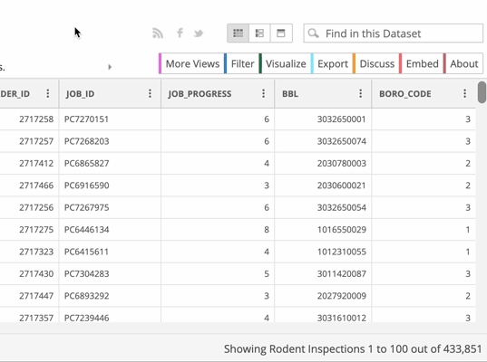

# Downloading NYC's rodent inspections data

The data that we’ll be using for this exercise is New York City’s **rodent inspections data.** The full file is [larger than Excel can support](../row-limits/), so we'll only be looking at 2019-2021.

## Navigating to the data

1. Visit the [Rodent Inspection page](https://data.cityofnewyork.us/Health/Rodent-Inspection/p937-wjvj) of the NYC OpenData portal
2. Click the **View Data** button, and take a second to examine the data. Does this look like the data we're looking for?

## Filtering the data

1. We don't want all 2+ million rows, so click the **Filter** button
2. Click **Add a new filter condition**
3. Use the dropdown to change `INSPECTION_TYPE` to `INSPECTION DATE`
4. Use the other dropdown to change `is` to `is between`
5. Use the date selection boxes to select **January 1, 2019** to **December 31, 2021**.

## Exporting the data

1. Click **Export**. It should automatically open the "Download" section.
2. Click **CSV** to download in CSV format. *Even though we are using Excel we will **not** be using CSV for Excel*

> If you're interested in understanding what **CSV for Excel** means, [read about encoding](../encoding)

# Downloading the data documentation

Beyond the data, there is typically additional documentation that can be used to help understand what the data is, how it was sourced, and what each column *really* means. **You always want to download any available documentation when sourcing data.**

This data set has both a user guide and a data dictionary.

Return to the [Rodent Inspection page](https://data.cityofnewyork.us/Health/Rodent-Inspection/p937-wjvj) to find and download the **user guide** and **data dictionary**.

> Tip: They are located under **Attachments**. If you can't find them on the page, I've also saved them [here](https://github.com/jsoma/excel-tutorials/raw/main/pivot-tables/DOHMHDataDictionary_NYCRodentInspection_August2020.xlsx) and [here](https://github.com/jsoma/excel-tutorials/raw/main/pivot-tables/User_Guide____NYC_Rat_Inspections_Final_August_2020.pdf).