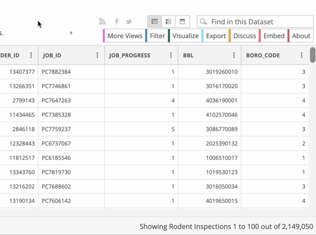

**Table of contents**

* [Downloading the data](#downloading-the-data)
* [Downloading the documentation](#downloading-the-documentation)

# Downloading the data

The data that we’ll be using for this exercise is New York City’s rodent inspections data.

## Navigating to the data

1. Visit the [Rodent Inspection page](https://data.cityofnewyork.us/Health/Rodent-Inspection/p937-wjvj) of the NYC OpenData portal
2. Click the **View Data** button, and take a second to examine the data. Does this look like the data we're looking for?

## Filtering the data

1. We don't want all 2+ million rows, so click the **Filter** button
2. Click **Add a new filter condition**
3. Use the dropdown to change `INSPECTION_TYPE` to `INSPECTION DATE`
4. Use the other dropdown to change `is` to `is between`
5. Use the empty date boxes to select January 1, 2019 to December 31, 2021

## Exporting the data

1. Click **Export**. It should automatically open the "Download" section. If not, click **Download**.
2. Click **CSV** to download in CSV format.

> If you're interested in understanding what **CSV for Excel** means, [read about encoding](../encoding)

# Downloading the data documentation

Beyond the data, there is typically additional documentation that can be used to help understand what the data is, how it was sourced, and what each column *really* means. **You always want to download any available documentation when sourcing data.**

This data set has both a user guide and a data dictionary.

Return to the [Rodent Inspection page](https://data.cityofnewyork.us/Health/Rodent-Inspection/p937-wjvj) to find and download the user guide and data dictionary.

> Tip: They are located under **Attachments** and are called `User Guide _ NYC Rat Inspections Final August 2020.pdf` and `DOHMHDataDictionary_NYCRodentInspection_August2020.xlsx`. If you can't find them on the page, I've also saved them [here](DOHMHDataDictionary_NYCRodentInspection_August2020.xlsx) and [here](User_Guide____NYC_Rat_Inspections_Final_August_2020.pdf).

# Part One: Data background

Before you start to analyze a dataset, you need to understand its content and limitations. To prepare for answering the questions below, you will want to skim through the documentation available to you. This includes:

1. The top portion of the [the Rodent Inspection page](https://data.cityofnewyork.us/Health/Rodent-Inspection/p937-wjvj)
2. The two documentation files you already downloaded
3. [This NYC city page on rats](https://www1.nyc.gov/site/doh/health/health-topics/rats.page), which is listed as the "data disclaimer" for the dataset.

You do not need to study them seriously, but you should have a passing familiarity with what the dataset covers.

## Questions

1. What division within the Department of Health and Mental Hygiene produces this data? 
2. What are some of the limitations of this data, according to the city’s description? 
3. Who are the current people that manage this dataset within the city? Please provide their names, titles, department, email and phone number, if applicable.  *Hint: in the documentation they are referred to as the Owner/Author.*
4. What are the names of the original people that created the dataset? 
5. What are the six Active Rat Signs (ARS) or Problem Conditions that could be included in the `RESULT` column? (You can copy and paste this from the documentation if you find it there)

# Part Two: Data analysis

Now that we have a decent grasp on the sourcing and limitations of the data, it's time to analyze the data itself.

## Data basics

### Open the file

Open the filtered rodent inspections file in Excel by using **File > Open** in Excel, or dragging the file to the Excel icon. You may be able to double-click the CSV file, but there's a chance it might open in another spreadsheet software (if you go that route, just pay attention!).

[Opening a file in Excel](file-open.png)

### Questions

1. How many rows are there in the data? *Tip: if there are 1,048,576, then you downloaded the full dataset instead of the filtered version. [Details on row limits here](../row-limits/)*
2. Do you notice any potential limitations of the data just by glancing through it? What are they? This only needs to be a cursory answer at this point, and if nothing strikes you as a limitation, no problem.

## Pivot tables

Using the rodent dataset, create a pivot table to count the reports on a borough and zip code basis. Technically, this means creating a pivot table with `BOROUGH` and `ZIP_CODE` as the rows, and `JOB_ID` as the values. *Tip: Make sure that in Values, it is constructing a count.*

The setup should look something like is displayed below.

[Pivot table fields with borough and zip code as rows and count of job id as values](pivot-fields.png)

Once constructed, the pivot table should look something like this:

[Example of what the pivot table should look like](pivot-displayed.png)

You are probably interested in what places have the most reports! Click on one of the values in the `Count of JOB_ID` column in the pivot table. Then, right click and select **Sort > Sort from Largest to Smallest**.

### Questions

1. What borough has had the most inspections since 2019?
2. List the zip codes with the top count for each borough, along with the number of inspections. Google the zip code to find out what neighborhood it is in. What are these zip codes and neighborhoods?
3. List the same information for the bottom zip codes. *Do not provide answers where a zip code has a count of zero, 1 or the zip code listed in the pivot table does not have a full five digits.*
4. How would you use this to create an accountability story? What additional information would you need to combine with what you have learned from this to develop an accountability story? Would you use additional data, and if so, what would that ideally be? You do not need to know if this data exists. 