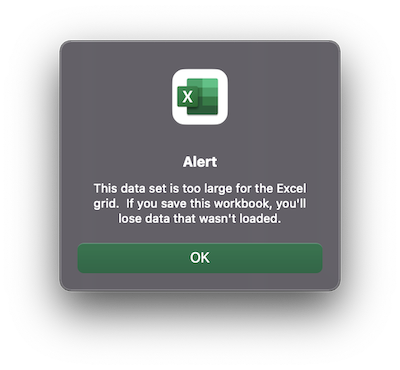
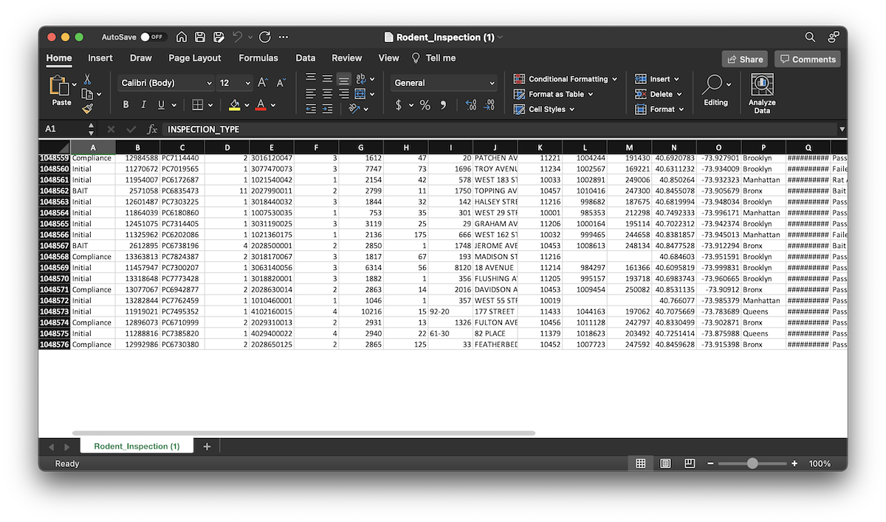

## Excel's row limits

When reading files into Excel, you're limited to 1,048,576 rows. Older versions of Excel that used `.xls` files were limited to 65,536 rows!

## Readings: 

* [Excel spreadsheet error blamed for UK’s 16,000 missing coronavirus cases](https://www.theverge.com/2020/10/5/21502141/uk-missing-coronavirus-cases-excel-spreadsheet-error), or [the BBC's coverage](https://www.bbc.com/news/technology-54423988) for more a detailed description.

## Witnessing Excel's row limits

1. Visit the [Rodent Inspection](https://data.cityofnewyork.us/Health/Rodent-Inspection/p937-wjvj) page of the NYC OpenData portal
2. Click the **View Data** button
3. Note the bottom right-hand corner "Showing Rodent Inspections 1 to 100 out of ....". How many is it? **Write this number down.**
4. Click **Export**. It should automatically open the "Download" section. If not, click **Download**.

Open this file in Excel by using `File > Open` in Excel (you can try double-clicking it, but there's always the chance it's set to open in another spreadsheet program). After waiting for Excel to process the file, you should witness an error similar to the notice below.

Notice that despite this issue, *Excel still opens the file*. 

Scroll down to the bottom and note the number of rows. For example, this is what it looks like on my computer:

Compare this with the number of inspections reported by the OpenData portal that you saved above. **How many rows are we missing?**